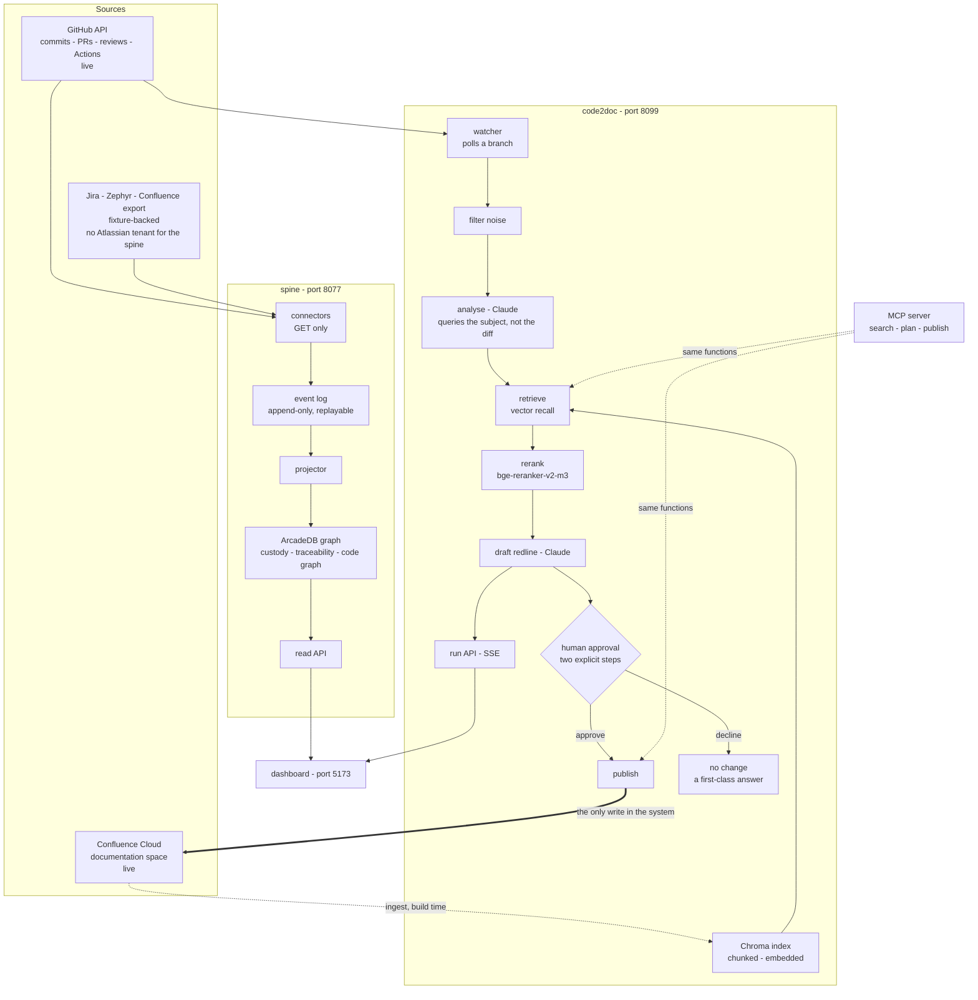

# SDLC Spine & code2doc

Two systems in one repository, sharing a dashboard.

**Spine** reads the tools a delivery team already uses — GitHub, CI, Confluence
— and answers questions none of them answer alone: who is accountable for this
right now, who had it before them, what does this requirement depend on, and if
we roll back that pull request what goes with it. It only reads.

**code2doc** watches a git branch. When a commit lands it works out which
documentation that commit just made untrue, drafts the correction, and waits for
a human to approve it. On approval it **writes to Confluence** — the one place
anything in this repository modifies a source system, and it is gated behind an
explicit two-step confirmation.

---

## Architecture



**Read everywhere, write in one place.** Every arrow into the system is a GET.
The single exception is `publish → Confluence`, drawn thick above, and it is
gated behind two explicit human confirmations. The spine's GitHub connector has
no write path at all — not disabled, absent.

**Two retrieval stages, because one is not enough.** Vector recall finds
candidates; the cross-encoder decides. They disagree often enough to matter — on
a live run the embedding ranked a wrong section *above* the right one (0.724 vs
0.696) and the reranker inverted it (−3.43 vs +2.65). Trust the ordering and the
gap, never the absolute score.

**The MCP server is a facade, not a second implementation.** Its tools call the
same `Retriever.search` and `publish_proposal` the HTTP routes call, so results
are identical rather than similar. Nothing in the pipeline imports it. See
[`demo/README.md`](demo/README.md#mcp).

**What is live and what is not.** GitHub and CI are real. The spine's
Confluence, Jira and Zephyr inputs are fixture-backed because there is no
Atlassian tenant behind them — while code2doc's Confluence is genuinely live,
and is what it reads and writes.

---

## Quick start

```bash
# macOS / Linux
./setup.sh          # check everything, install what is missing
./start.sh          # run all three services, print the URLs
./stop.sh

# Windows (PowerShell)
.\setup.ps1
.\start.ps1
.\stop.ps1

# Windows (double-click)
setup.cmd  ·  start.cmd  ·  stop.cmd
```

Every script is safe to re-run. `setup` checks before it acts, so a second run
finishes in seconds and tells you what it found. If something is wrong later,
`./doctor.sh` (or `doctor.cmd`) reports what without changing anything.

**One thing a clone does not bring with it: the delivery graph.** ArcadeDB is a
live database directory, so `data/` is not in git. code2doc is complete on a
fresh clone -- the documentation corpus and its index are committed -- but the
delivery, traceability and graph views are empty until you build the graph once:

```bash
python scripts/run.py start --rebuild
```

That reads GitHub, so it needs a `GITHUB_TOKEN` with access to the subject
repository. It takes a few minutes and you only do it once; `setup` tells you
whether you still need to.

### Where things end up

| Surface | URL | What it is |
|---|---|---|
| **My actions** | http://127.0.0.1:5173/ | What is waiting on one engineer |
| **Live pipeline** | http://127.0.0.1:5173/live | A commit, and the docs it made stale |
| Delivery console | http://127.0.0.1:5173/delivery | Packets, requirements, PRs, tests, defects, people |
| Traceability | http://127.0.0.1:5173/traceability | Requirement → code → test → defect |
| Graph explorer | http://127.0.0.1:5173/graph | The knowledge graph, interactive |
| Spine API | http://127.0.0.1:8077/health | JSON over the graph |
| code2doc API | http://127.0.0.1:8099/docs | OpenAPI, including `/impact` |
| ArcadeDB Studio | http://localhost:2480/ | The database's own browser (user `root`) |

---

## What you need

| | Why | If missing |
|---|---|---|
| **Python 3.10+** | Both services | setup tells you |
| **Node.js 18+** | The dashboard | https://nodejs.org |
| **PyTorch** | Embeddings and reranking | `setup` installs the right build — see below |
| **~3.6 GB of models** | `bge-large-en-v1.5`, `bge-reranker-v2-m3` | `setup` downloads them |
| **NVIDIA GPU** | Optional | CPU works; a query takes ~10s instead of ~1s |
| **~2 GB free disk** | Beyond the models | — |

`setup` installs PyTorch for you and picks the build from your hardware. It
reads `nvidia-smi` for the driver's CUDA major version and chooses accordingly:

| Detected | Wheel |
|---|---|
| NVIDIA, CUDA 12.x driver | `download.pytorch.org/whl/cu126` |
| NVIDIA, CUDA 11.x driver | `download.pytorch.org/whl/cu118` |
| Apple Silicon | default PyPI wheel (Metal) |
| No NVIDIA GPU | `download.pytorch.org/whl/cpu` |

A 12.x driver takes a cu126 wheel on purpose -- CUDA guarantees minor-version
compatibility, so pinning the exact driver version would reject builds that
work. It is a ~2.5 GB download, so the first `setup` is slow; `doctor` tells you
what it detected without installing anything.

### Credentials

Copy `demo/.env.example` to `demo/.env` and fill in four values. Each one
disables exactly one part of the demo if left blank, and `doctor` says which.

| Variable | Where to get it | Without it |
|---|---|---|
| `CONFLUENCE_EMAIL` | Your Atlassian account email | No Confluence read or write |
| `CONFLUENCE_API_TOKEN` | https://id.atlassian.com/manage-profile/security/api-tokens | ⤴ |
| `GITHUB_TOKEN` | A read-only fine-grained PAT for the watched repo | No commit watching |
| `ANTHROPIC_API_KEY` | https://console.anthropic.com/settings/keys | No analysis or redlines |

**The committed index means you can skip Confluence entirely to start.**
`demo/docs/` (the corpus as Markdown) and `demo/data/` (the ~1 MB Chroma index)
are in git, so retrieval works on a fresh clone with no Atlassian account. You
only need Confluence credentials to re-ingest or to publish.

`GITHUB_TOKEN` is the one credential with a second job: besides watching commits
it is what `--rebuild` uses to build the delivery graph, so the delivery and
traceability views need it even though code2doc does not.

---

## The demo

The story: **you change one line of code, and the system works out which
documentation that just made wrong.**

1. **Start everything** — `./start.sh`, then open http://127.0.0.1:5173/
2. **Point it at a branch** — `WATCH_BRANCH` in `demo/.env`, or
   `./start.sh --branch my-branch`
3. **Make a small, meaningful change** and push it. It has to be semantically
   real: a rename or a reformat gives the retrieval nothing to work with.
   The reference change is in `PaymentRequestDTO.java`:
   ```java
   -    @DecimalMin(value = "0.01", message = "amount must be greater than zero")
   +    @DecimalMin(value = "1.00", message = "amount must be at least 1.00")
   ```
   The Confluence page documents that constraint as a table cell reading
   `Minimum 0.01`, so the change provably makes it stale.
4. **A popup appears within ~7 seconds** of the push, wherever you are in the
   dashboard, and tracks the stages as they happen.
5. **Open the live pipeline.** Two tracks: GitHub's, which takes minutes, and
   code2doc's, which takes about thirty seconds. The gap is the point — the doc
   track finishes while the build is still running.
6. **Read "What happened"** — five numbered steps, each showing its real output
   and how long it took.
7. **Approve.** *Check against the live page* plans the edit; *Approve &
   publish* performs it. Then open the Confluence page and show the new version.

### Rehearsing without pushing

```bash
cd demo
python -m code2doc.cli replay <sha> --force
```

Runs the whole pipeline against a commit that already exists, as many times as
you like. Use it before presenting.

---

## How code2doc works

```
   commit ──▶ filter noise ──▶ analyse (Claude) ──▶ retrieve ──▶ rerank
                                                                   │
                     Confluence ◀── publish ◀── approve ◀── draft ◀─╯
```

Five stages, each with a job small enough that a bad result can be attributed to
one of them rather than to "the AI".

**Three findings worth knowing**, all measured on this corpus:

**Query phrasing dominates everything.** Scoring the same target section against
the same distractor, changing only how the query is worded:

| Query form | Score |
|---|---|
| A statement about the change | **−2.78** |
| The raw `git diff` | −0.75 |
| **A topic / noun phrase** | **+2.97** |

A 5.7-point swing from phrasing alone. Documentation states what a system *is*;
it never narrates changes. So the agent is instructed to query the **subject
matter**, never the edit — that is what pulls the right section from −2.78 to
+2.65 in the live demo.

**Absolute scores are not portable.** The same well-formed query scored +4.06 on
one corpus and +2.97 on another. Ranking and the gap between results are
reliable; a fixed threshold is not. The UI shows bars relative to the best
result in each search, never an absolute confidence.

**Declining to edit is a first-class answer.** Across three real commits the
system considered nine sections and edited two. One decline reads: *"The table
already documents currency as '3 uppercase letters', which matches the newly
added `@Pattern(regexp = "[A-Z]{3}")`"* — it worked out the code had caught up
to the docs. That restraint is what makes the rest trustworthy.

Deeper design notes, including why the vector store is Chroma and why the
Confluence write edits raw XHTML rather than a parsed tree, are in
[`demo/README.md`](demo/README.md).

---

## Layout

```
spine/     event-sourced ingestion → ArcadeDB graph → read API   (:8077)
demo/      code2doc: watch, analyse, retrieve, draft, publish    (:8099)
web/       React dashboard over both                             (:5173)
scripts/   doctor.py and run.py — one implementation, three OSes
docs/      design spec, and OPEN-ACTIONS.md (what needs a human)
logs/      service output, written by start
```

The OS wrappers (`*.sh`, `*.ps1`, `*.cmd`) do only what a shell must — find a
Python — then hand over to `scripts/`. That keeps the checks from drifting
between platforms.

---

## Known issues

Read this before demoing.

- **Proposals go stale once one is published.** Each proposal is drafted against
  the page as it was. Publish one and any other proposal touching the same text
  will fail its check — safely, with a message, but it will fail. Approve one
  change per page, then re-run. Proper handling is not built.
- **The Confluence space and `app_src` only partly match.** Both have
  `PaymentController` and `PaymentServiceImpl`, and `createPayment` is real. The
  docs also describe `initiate`, `track` and a `PUT` that **do not exist** in the
  code, while the code has `cancelPayment` the docs never mention. Demo the
  `amount` change, which both sides genuinely share — or use the mismatch
  deliberately as the problem statement.
- **The corpus is small — 43 chunks over 7 pages.** Retrieval works and looks
  good, but this is not evidence it scales. Do not claim top-3 accuracy figures.
- **Section anchors are best-effort.** Confluence builds heading anchors
  client-side and the rule has changed between editors; a URL fragment never
  reaches the server, so no request can verify one. The page URL is always
  correct; the anchor may need a scroll.
- **Self-approval of pull requests is impossible on GitHub.** If you want an
  approval step in the demo, use a deployment environment gate (which *can* be
  self-approved) — `scripts/bootstrap-governance.sh` configures it. The current
  demo drops the code-approval beat entirely.
- **The live pipeline page scroll-jumps** when switching between commits,
  because the page height changes. Cosmetic.
- **`GITHUB_TOKEN` in the repository history is compromised** — it was pasted
  into a chat. It is read-only and cannot reach the demo repo, but it can read
  11 other repositories, 4 of them private. **Rotate it.**

Longer list, including everything needing a second account or a credential:
[`docs/OPEN-ACTIONS.md`](docs/OPEN-ACTIONS.md).

---

## Troubleshooting

| Symptom | Cause | Fix |
|---|---|---|
| `./doctor.sh` reports missing packages | Fresh checkout | `./setup.sh` |
| Spine fails on `tree_sitter_java` | Its deps live in `spine/.venv` | `./setup.sh`, or `cd spine && pip install -r requirements.txt` |
| Dashboard shows *"spine unreachable — seeded"* | Spine not running | `./start.sh`; it is honest, not broken — it refuses to imply live data |
| Live pipeline shows *"Cannot reach code2doc"* | Port 8099 down | `./start.sh`, then check `logs/code2doc.log` |
| Models re-download every run | Path not found | `./doctor.sh` prints where it looked |
| `UnicodeEncodeError` in a terminal | Windows cp1252 | Already handled in the scripts; if you see it elsewhere, `set PYTHONUTF8=1` |
| Publish says *"could not find this text"* | The page moved on | Re-run `ingest` then `index`, then re-analyse the commit |
| Watcher sees nothing | Wrong branch | `./start.sh --branch <name>`; check `logs/code2doc.log` for `watching …` |

Logs for every service are in `logs/`. Start there.
